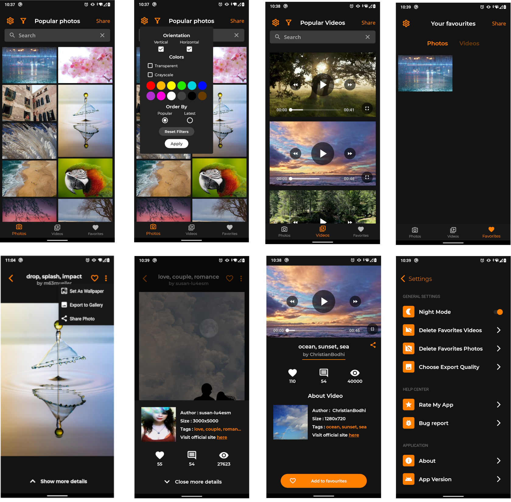

## Imagine

### Kotlin wallpaper and image saver app :fire:

 
 

 
 

A Few resources to get when you start write your first project in kotlin:
- [Kotlin Codelabs](https://developer.android.com/codelabs/kotlin-android-training-welcome#0)
- [Kotlin Documentation](https://kotlinlang.org/docs/reference/)

##### It's a easily to use and modern app, which you can find your favourite photo, save it into gallery or set it as wallpaper. Also you can share photo to your friends. App of course provides videos, which you can watch, save to favourites or share to your friends. 

 
 

### Used technology:
- Android Jetpack Navigation With Safe Args 🧭 [link](https://developer.android.com/guide/navigation/navigation-getting-started) 
- Room Database :atom: [link](https://developer.android.com/training/data-storage/room)
- GSON 👁️‍🗨️ [link](https://github.com/google/gson)
- RxJava Asynchronous code 👁️ [link](https://github.com/ReactiveX/RxAndroid)
- Pixabay images and videos API 🖼️️ [link](https://pixabay.com/api/docs)
- Retrofit 🌈️ [link](https://square.github.io/retrofit)
- Implicit Intents ⚓️ [link](https://developer.android.com/guide/components/intents-filters#ExampleSend)
- MVVM Clean Architecture 💡️ [link](https://developer.android.com/jetpack/guide)
- Glide Image Fetching 👀️ [link](https://github.com/bumptech/glide)
- Htextview Animated TextViews 🌞️ [link](https://github.com/hanks-zyh/HTextView)